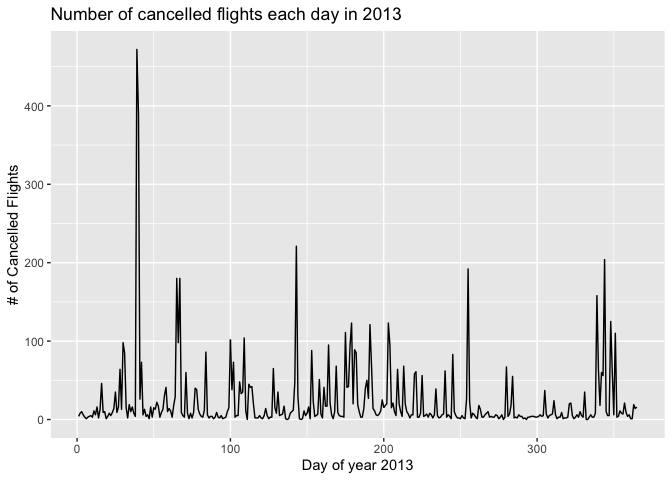
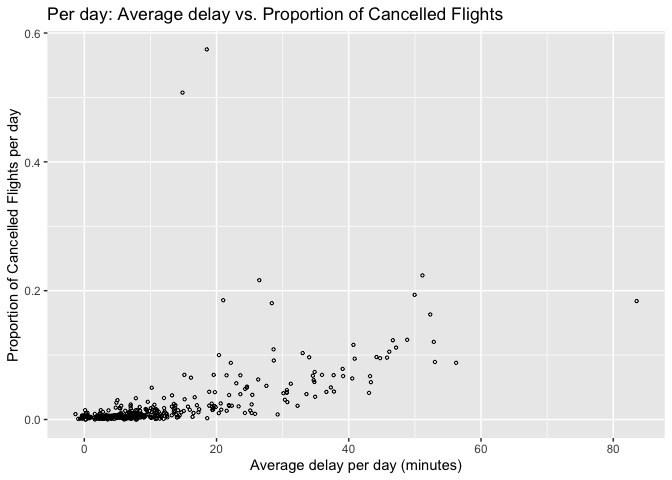

Homework 2
================
Alex G
2/10/2021

##### How many flights have a missing dep\_time?

##### What other variables are missing?

##### What might these rows represent?

``` r
dp.na = sum(is.na(flights$dep_time))
cat("There are", dp.na, "flights with a missing departure time. \n")
```

    ## There are 8255 flights with a missing departure time.

``` r
flights %>% 
  filter(is.na(dep_time))
```

    ## # A tibble: 8,255 x 19
    ##     year month   day dep_time sched_dep_time dep_delay arr_time sched_arr_time
    ##    <int> <int> <int>    <int>          <int>     <dbl>    <int>          <int>
    ##  1  2013     1     1       NA           1630        NA       NA           1815
    ##  2  2013     1     1       NA           1935        NA       NA           2240
    ##  3  2013     1     1       NA           1500        NA       NA           1825
    ##  4  2013     1     1       NA            600        NA       NA            901
    ##  5  2013     1     2       NA           1540        NA       NA           1747
    ##  6  2013     1     2       NA           1620        NA       NA           1746
    ##  7  2013     1     2       NA           1355        NA       NA           1459
    ##  8  2013     1     2       NA           1420        NA       NA           1644
    ##  9  2013     1     2       NA           1321        NA       NA           1536
    ## 10  2013     1     2       NA           1545        NA       NA           1910
    ## # … with 8,245 more rows, and 11 more variables: arr_delay <dbl>,
    ## #   carrier <chr>, flight <int>, tailnum <chr>, origin <chr>, dest <chr>,
    ## #   air_time <dbl>, distance <dbl>, hour <dbl>, minute <dbl>, time_hour <dttm>

``` r
cat("Other variables that are missing along with dep_time are dep_delay, arr_time, arr_delay, and air_time. Using this info, these flights with missing departure times most likely represent cancelled flights.")
```

    ## Other variables that are missing along with dep_time are dep_delay, arr_time, arr_delay, and air_time. Using this info, these flights with missing departure times most likely represent cancelled flights.

##### Currently dep\_time and sched\_dep\_time are convenient to look at, but hard to compute with because they’re not really continuous numbers. Convert them to a more convenient representation of number of minutes since midnight.

``` r
flights %>% 
  select(dep_time, sched_dep_time)
```

    ## # A tibble: 336,776 x 2
    ##    dep_time sched_dep_time
    ##       <int>          <int>
    ##  1      517            515
    ##  2      533            529
    ##  3      542            540
    ##  4      544            545
    ##  5      554            600
    ##  6      554            558
    ##  7      555            600
    ##  8      557            600
    ##  9      557            600
    ## 10      558            600
    ## # … with 336,766 more rows

``` r
flights.new = mutate(flights,
                     dep_time.new = (dep_time %/% 100)*60 + (dep_time %% 100),
                     sched_dep_time.new = (sched_dep_time %/% 100)*60 + (sched_dep_time %% 100))
flights.new$dep_time = NULL
flights.new$sched_dep_time = NULL
flights.new = flights.new[,c(1,2,3,18,19,4,5,6,7,8,9,10,11,12,13,14,15,16,17)]
flights.new
```

    ## # A tibble: 336,776 x 19
    ##     year month   day dep_time.new sched_dep_time.… dep_delay arr_time
    ##    <int> <int> <int>        <dbl>            <dbl>     <dbl>    <int>
    ##  1  2013     1     1          317              315         2      830
    ##  2  2013     1     1          333              329         4      850
    ##  3  2013     1     1          342              340         2      923
    ##  4  2013     1     1          344              345        -1     1004
    ##  5  2013     1     1          354              360        -6      812
    ##  6  2013     1     1          354              358        -4      740
    ##  7  2013     1     1          355              360        -5      913
    ##  8  2013     1     1          357              360        -3      709
    ##  9  2013     1     1          357              360        -3      838
    ## 10  2013     1     1          358              360        -2      753
    ## # … with 336,766 more rows, and 12 more variables: sched_arr_time <int>,
    ## #   arr_delay <dbl>, carrier <chr>, flight <int>, tailnum <chr>, origin <chr>,
    ## #   dest <chr>, air_time <dbl>, distance <dbl>, hour <dbl>, minute <dbl>,
    ## #   time_hour <dttm>

##### Look at the number of cancelled flights per day.

##### Is there a pattern?

##### Is the proportion of cancelled flights related to the average delay?

##### Use multiple dyplr operations, all on one line, concluding with \`ggplot(aes(x= ,y=)) + geom\_point()’

``` r
by_day = group_by(flights.new, year, month, day)
summarise(by_day, canc_flights = sum(is.na(dep_time.new) & is.na(arr_time)))
```

    ## # A tibble: 365 x 4
    ## # Groups:   year, month [12]
    ##     year month   day canc_flights
    ##    <int> <int> <int>        <int>
    ##  1  2013     1     1            4
    ##  2  2013     1     2            8
    ##  3  2013     1     3           10
    ##  4  2013     1     4            6
    ##  5  2013     1     5            3
    ##  6  2013     1     6            1
    ##  7  2013     1     7            3
    ##  8  2013     1     8            4
    ##  9  2013     1     9            5
    ## 10  2013     1    10            3
    ## # … with 355 more rows

``` r
flights.by.day = flights.new %>% 
  mutate(day_of_year = yday(time_hour)) %>% 
  group_by(day_of_year) %>% 
  summarise(prop.canc_flights = sum(is.na(dep_time.new) & is.na(arr_time)) / n(),
            av_delay = mean(dep_delay, na.rm = T),
            canc_flights = sum(is.na(dep_time.new) & is.na(arr_time)))

ggplot(aes(x = day_of_year, y =  canc_flights), data = flights.by.day) +
  geom_line() +
  ggtitle("Number of cancelled flights each day in 2013") +
  xlab("Day of year 2013") +
  ylab("# of Cancelled Flights")
```



``` r
print("There does not seem to be much of a pattern concerning the number of cancelled flights per day")
```

    ## [1] "There does not seem to be much of a pattern concerning the number of cancelled flights per day"

``` r
flights.new %>%
  mutate(day_of_year = yday(time_hour)) %>% 
  group_by(day_of_year) %>% 
  summarise(prop.canc_flights = sum(is.na(dep_time.new) & is.na(arr_time)) / n(),
            av_delay = mean(dep_delay, na.rm = T)) %>%
  ggplot(aes(x = av_delay, y = prop.canc_flights)) + 
  geom_point(size = .8, shape = 1) +
  ggtitle("Per day: Average delay vs. Proportion of Cancelled Flights") +
  xlab("Average delay per day (minutes)") +
  ylab("Proportion of Cancelled Flights per day")
```



``` r
summary(lm(av_delay ~ prop.canc_flights, data = flights.by.day))
```

    ## 
    ## Call:
    ## lm(formula = av_delay ~ prop.canc_flights, data = flights.by.day)
    ## 
    ## Residuals:
    ##     Min      1Q  Median      3Q     Max 
    ## -68.027  -5.916  -2.649   3.547  49.415 
    ## 
    ## Coefficients:
    ##                   Estimate Std. Error t value Pr(>|t|)    
    ## (Intercept)         9.4490     0.6104   15.48   <2e-16 ***
    ## prop.canc_flights 134.1952    10.6490   12.60   <2e-16 ***
    ## ---
    ## Signif. codes:  0 '***' 0.001 '**' 0.01 '*' 0.05 '.' 0.1 ' ' 1
    ## 
    ## Residual standard error: 10.56 on 363 degrees of freedom
    ## Multiple R-squared:  0.3043, Adjusted R-squared:  0.3024 
    ## F-statistic: 158.8 on 1 and 363 DF,  p-value: < 2.2e-16

``` r
print("Using the graph and summary table, there seems to be a relationship between the proportion of cancelled flights and the average delay for each day of the year 2013.")
```

    ## [1] "Using the graph and summary table, there seems to be a relationship between the proportion of cancelled flights and the average delay for each day of the year 2013."
